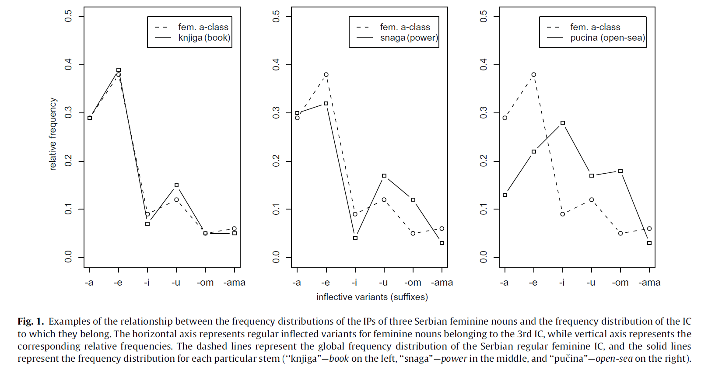

This research was completed in collaboration with [Petar Milin](https://www.birmingham.ac.uk/staff/profiles/languages/milin-petar.aspx) and [Benjamin V. Tucker](https://sites.ualberta.ca/~bvtucker/index.html).

In certain languages, new forms of a word with slightly different meanings can be created by adding one of the standard set of so-called inflectional suffixes used in that language. For example, the verb *work* can be made to fit a third person by adding an inflectional suffix *\-s* to make *he/she/it works*. Languages like Serbian or Romanian belong to the group of inflected languages because they use this tool to create different forms of words profusely. In the image below, taken from [Milin et al. (2009)](https://www.sciencedirect.com/science/article/abs/pii/S0749596X08000831?casa_token=vPKibcyA1RwAAAAA:ajdcPyq1oeosF6HT2gW3zMJ4Vy8qLHiZs6D51p3ZlGx_00yHgpgplVmYHTmoV_S9RdoU5eKC-ss), you can see that in Serbian as many as seven different suffixes presented on the x-axis can be attached to the base of the feminine noun *book* (*knjig*) to create new word forms. For example, *knjigom* means *with the book*. Some of these suffixes may have more than one meaning or serve more than one function, but that is a whole different story altogether.

Many words in an inflected language follow the same process of inflection, that is, they use the same inflectional suffixes to create different word-forms. These words are then said to belong to the same inflectional class, as is the case with the example feminine nouns *book*, *strength*, and *open-sea* in Serbian. In the example below, *book* has a distribution of relative frequencies of its word-forms that is nearly identical to the one of the entire class it belongs to (feminine a-class). In turn, the Serbian word meaning *open-sea* shows a substantial lack of alignment to the class. This lack of alignment is called "relative entropy". Previous studies show that words with a word-form frequency distribution more similar to the word-form frequency of the entire class they belong to are also processed faster. In other words, it is easier to deal with words like *book* which show a word-form frequency pattern like most words in their class, than with words like *open-sea*.

These findings come primarily from visual lexical decision studies. In these studies, the participants are presented with written words and made-up strings of letters. Their task is to decide whether something is a word or not as quickly and as accurately as possible. However, spoken word recognition and reading are not quite one and the same. For example, the acoustic signal unfolds in time, while a single word (or a non-word string of letters) can be glimpsed in a single look. Additionally, one can always have another look at a written word, but we cannot "turn back the time" and replay something that has been uttered. For those and other reasons I do not mention here, we decided to test whether the relative entropy effect can be replicated in an auditory lexical decision task. That is, we presented our participants with audio word recordings rather than written words. We also tested the effect in a new language (Romanian) and used verbs and their different forms, rather than nouns as in the example above. The effect of relative entropy in verbs was already recorded in a previous study, but in Serbian and with written words ([Filipović-Đurđević & Gatarić, 2018](http://scindeks.ceon.rs/article.aspx?query=ARTAU%26and%26isidora%2bgataric&page=0&sort=1&stype=0&backurl=%2fSearchResults.aspx%3fquery%3dARTAU%2526and%2526isidora%252bgataric%26page%3d0%26sort%3d1%26stype%3d0%26lang%3den&lang=en)).

Our results also captured the relative entropy effect, as can be seen in the figure at the top of this page. The figure shows the effect for the time it takes participants to recognize whether the sound recording is a word of Romanian, but we found a similar effect for participant accuracy. If a verb has a distribution of relative frequencies of its forms that is much different than the class it belongs to, listeners make more errors (they are more prone to say that it is not a word) or they respond to the verb more slowly. These findings are important because they inform us that speakers of a language are sensitive to 

Much more detail and topics I do not mention in this brief overview can be found in our upcoming [research article](https://benjamins.com/catalog/ml.20010.nen), or by looking at the pre-print available [here](https://psyarxiv.com/fb6p9/).