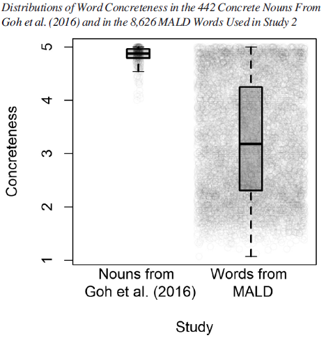

This project was done in collaboration with [Ryan G. Podlubny](https://podlubny.wordpress.com/home/), [Daniel Schmidtke](https://www.danschmidtke.com/), [Matthew C. Kelley](https://faculty.washington.edu/mattck/), and [Benjamin V. Tucker](https://sites.ualberta.ca/~bvtucker/index.html).

Researchers are debating, based on empirical findings, about what information is utilized in the process of spoken word recognition and how that information is utilized by the listener. A good first step for an interested reader on this topic could be [McQueen's (2008) chapter in *The Oxford Handbook of Psycholinguistics*](https://doi.org/10.1093/oxfordhb/9780198568971.001.0001).

At first slowly, but now more steadily, evidence accumulated that various word characteristics related to its meaning (jointly referred to as a word's *semantic richness*) may also influence visual word recognition. For example, we are quicker to recognize concrete words than abstract words (*apple* vs. *belief*) or more arousing words (*snake* vs. *grain*). However, reading is not the same as listening to speech, so what happens in spoken word recognition? [Goh et al. (2016)](https://www.frontiersin.org/articles/10.3389/fpsyg.2016.00976/full) conducted a fairly large study to test that and found that various semantic richness variables predicted participant performance in both the auditory lexical decision task and semantic classification task.

Still, the items used by Goh et al. (2016) were limited in some regards. For example, the words they presented to their participants were all high-concreteness nouns. We decided to test whether their findings can be replicated using a much larger and more diverse set of words, as well as a larger number of participants, both made available through [the MALD project](https://aphl.artsrn.ualberta.ca/?page_id=827). We increased the number of considered words and expanded on the range of concreteness as shown in the figure below.

Our results indicate that both rating-based and corpus-based measures predict participant response latency in the auditory lexical decision task, even when we statistically control for other relevant word characteristics. The figure on the top of this page is one example for what we find: we see that low valence (negative words) and high valence (positive) words are recognized earlier in comparison to words with neutral valence.

It seems that some of the models of (isolated) spoken word recognition may need some updating to better account for effects such as these. For more information about this study, see [our paper](https://psycnet.apa.org/doiLanding?doi=10.1037%2Fxlm0001208).
