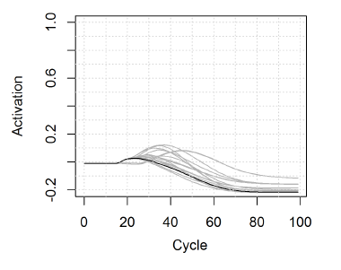

This project is done in collaboration with [Benjamin V. Tucker](https://sites.ualberta.ca/~bvtucker/index.html).

[TRACE](https://psycnet.apa.org/record/1986-10942-001) is one of the most notable computational models of spoken word recognition. A more approachable reimplementation of TRACE called [jTRACE](https://magnuson.psy.uconn.edu/jtrace/) was created in 2007. An even newer model based on TRACE, called [TISK](https://link.springer.com/article/10.3758/s13428-017-1012-5), was recently developed.

The figure above shows how the process of spoken word recognition unfolds according to these models. The target word is the word *group*. As time passes (x-axis), various competitors (different lines) rise in activation (y-axis). As more information becomes available, most candidates will start losing activation and drop off, but one of them will keep rising until it is eventually selected as the winner. In this figure, the red line represents the word *group* and it wins (ignore the green line, please) so - yay!

Performance of TRACE (that is, jTRACE and TISK) was never compared to large-scale data from auditory lexical decision experiments. The question is whether the time cycle in which the winner is selected in the model corresponds to the time it takes an actual human listener to respond to that same word. If it does, then there is an argument to be made that the computational model and the human listener go through a roughly similar process in selecting which word they "heard". We tested exactly that by comparing jTRACE and TISK estimates to human data from the [Massive Auditory Lexical Decision](http://aphl.artsrn.ualberta.ca/?page_id=827) project.

The default dictionary of jTRACE and TISK includes only 14 different phonemes and a total of 212 words made from them. We used that in our first simulation. The models were almost perfect at selecting the right word as the winner under these circmustances. However, the correlation between the estimated time cycle when the winner is selected and the average response latency of human participants to that same word was very low. So, it did not really work, but that could be because the "English" that the models know is much different in comparison to the English our participants knew.

To fix that, in the second simulation we expanded the set of phonemes to include all of the phonemes of English and used a new list of 442 words. Under these circumstances, jTRACE had a lot of difficulties selecting the right word from the lexicon, especially if the word included affricates or diphthongs. For example, the best competitors for the word *cherry* were words *tent*, *telephone*, *pear*, and so on and just look how sad the activation looks in the figure below, showing this example. Unfortunately, affricates and diphthongs seem to be in 53% of the words present in the [Carnegie-Mellon University pronouncing dictionary](http://www.speech.cs.cmu.edu/cgi-bin/cmudict)!

TISK still performed very well in recognizing the right word out of the list of 442. However, the correlation with participant response latency also remained very low. The small contribution TISK estimates made to predicting how much time it will take a human participant to recognize a stimulus as a word could entirely be replaced simply by word length in phonemes.

In the third simulation, we wanted to present TISK with a lexicon that may be more similar to what participants have in their heads and test whether it can then perform more similarly to humans. We did that by creating separate lexicons for every word, so that word competition is higher and therefore more realistic. Unfortunately, this only made TISK accuracy in selecting the right word as the winner to plummet from close to 100% to less than 30%.

Lastly, the fourth simulation showed that TISK has a tendency to incorrectly recognize pseudowords (those are made up words that actually do not exist in the lexicon) as existing words when using the same setup as in previous simulations.

In short, jTRACE does not have a way of representing all of the phonemes in English, while TISK fails with close competition and discarding pseudoword input as non-existent. [This publication](https://www.tandfonline.com/doi/abs/10.1080/23273798.2020.1764600?casa_token=KCVMfwhgTX4AAAAA:sTUug88OdBI5bbf57Ls1e3XxKjaJMwDwXZbwfGhC0dxkPH1-2dsQlxmATUOYYxncEtLWN-UQ9e8E_A) includes a more detailed description of the simulations and a more thorough discussion on the ramifications of the findings.
