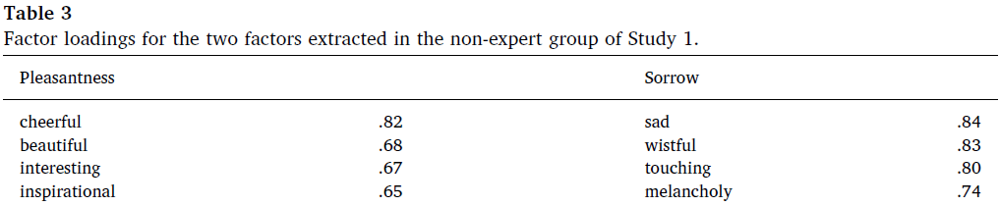
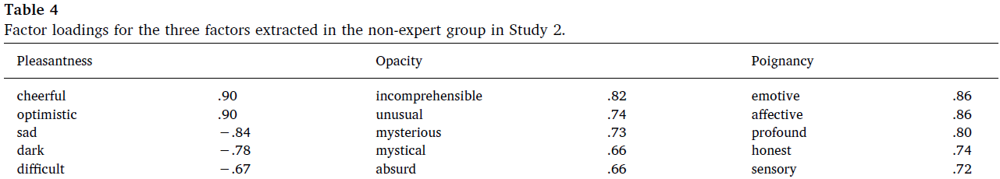
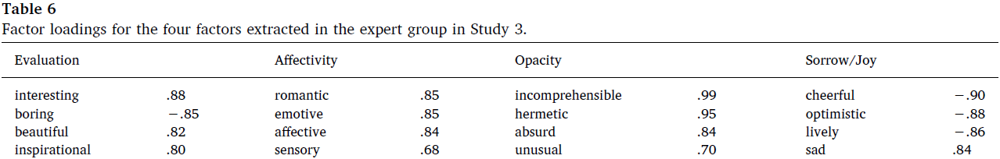

This research was completed in collaboration with Dušan Vejnović and [Slobodan Marković.](https://scholar.google.com/citations?user=PsxPD8sAAAAJ&hl=sr&oi=sra)

One strand of personality psychology reasoned like this: important psychological characteristics of humans will be coded in language because we want to be able to refer to them. In other words, we describe people in words and we will have words for important personality characteristics. We can extract the most important or frequent descriptors and have people rate themselves or other people on them. Then we can group these descriptors according to the correlation of their ratings - et voilà - we have the basic dimensions of human personality. This is called the lexical hypothesis and it brought you, for example, [the Big Five](https://en.wikipedia.org/wiki/Big_Five_personality_traits) personality traits.

Researchers applied similar reasoning to studying the connotative meanings of words, and, slightly later, art, in an attempt to extract their basic characteristics. Soon, many studies have been conducted in which participants rated paintings, architectural objects, music, dance performances, or poetry. In the case of poetry, however, research methodology was often flawed by using too few descriptors or arbitrarily selected descriptors, presenting participants with a single poem, and so on.

We wanted to create a scale of subjective experience of poetry that does not have such issues. Additionally, we wanted to see whether the subjective experience readers have is different in expert readers (poets, critics, university professors of literature) versus non-expert readers of literature.

We asked students of literature and students of psychology to provide us with words they would use to describe poetry. We took the most frequent ones from each group and created two sets of scales: an expert set (literature) and a non-expert set (psychology). We also asked a couple of students of literature to go through beween four and five hundred poems from various poetry anthologies and select 20 that they thought would represent different kinds of poetry well.

In the first study, we found four basic factors of subjective experience of poetry in experts: evaluation, affectivity, joy/sorrow, and opacity (see the image on the top of this page). Non-experts had a much simpler view including only pleasantness of the poem and how sorrowful it was (given in the image below).

In the second study, a new group of non-experts used the expert set of descriptors. The basic dimensions of subjective experience of poetry were a bit more complex now.

Lastly, we wanted to see whether the dimensions of subjective experience of poetry extracted for expert readers were stable. We bothered the same two literature students to provide us with a new set of 20 poems and found a new group of expert readers. The results remained the same.

It seems that expert readers of poetry have a more fine-grained representation of its basic characteristics as they read and rate it. You can read more about the study and what we think of these results in this [paper we published.](https://www.sciencedirect.com/science/article/abs/pii/S0304422X18301529) You can also find a lot more material in our [Open Science Framework project](https://osf.io/2mvgd/) and yes, the materials include the poems that we used. The poems are in Serbian, however, so if you're looking for some poetry to read and don't speak Serbian, the two sets of poems that we used and links to some of them can be found {}here.{} Enjoy.